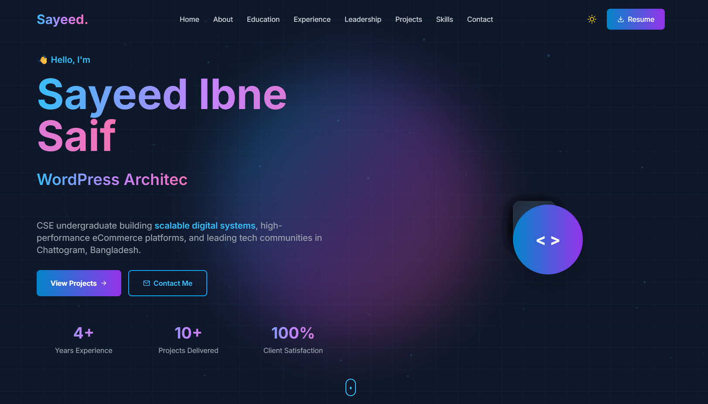

# My Portfolio Website 🚀

Welcome to my personal portfolio! This is where I showcase my journey as a developer, my projects, skills, and experiences. I built this portfolio from scratch to create a unique and engaging experience that reflects my personality and technical abilities.

## 🌐 Live Demo

**Visit my portfolio:** [https://sayeed-portfolio-xi.vercel.app/](https://sayeed-portfolio-xi.vercel.app/)



## 💡 About This Project

I designed and developed this portfolio website to showcase my work and skills in a modern, interactive way. The goal was to create something that stands out from typical portfolio websites—combining smooth animations, engaging interactions, and a clean design that works seamlessly across all devices.

### Why I Built This Portfolio

- **Showcase My Work**: Present my projects, skills, and experiences in an organized and visually appealing manner
- **Demonstrate Technical Skills**: Show my proficiency with modern web technologies and best practices
- **Create a Personal Brand**: Establish a professional online presence that represents who I am as a developer
- **Practice and Learn**: Challenge myself to implement advanced features like custom cursors, particle effects, and complex animations

## ✨ Key Features

### 🎨 **Design & User Experience**
- Modern, futuristic design with glassmorphism effects and gradient accents
- Fully responsive layout that adapts perfectly to mobile, tablet, and desktop screens
- Dark/Light mode toggle with smooth theme transitions
- Custom animated cursor effect for desktop users
- Interactive particle background that responds to user interaction

### ⚡ **Performance & Optimization**
- Built with Next.js 14 App Router for optimal performance and SEO
- Server-side rendering for fast initial page loads
- Optimized images and lazy loading for better performance
- TypeScript for type safety and better developer experience

### 🎭 **Animations & Interactions**
- Smooth scroll animations using Framer Motion and GSAP
- Typing animation in the hero section
- Animated statistics counter in the About section
- Progress bars with smooth fill animations in Skills section
- Hover effects and transitions throughout the site
- Back-to-top button with smooth scroll
- Scroll progress indicator

### 📋 **Content Sections**
- **Hero**: Eye-catching introduction with typing animation
- **About**: Personal introduction with animated statistics
- **Education**: Timeline showcasing my academic journey
- **Experience**: Professional experience with detailed descriptions
- **Leadership**: Leadership roles and community impact
- **Skills**: Organized skill categories with proficiency levels
- **Projects**: Filterable project showcase with live demos and GitHub links
- **Contact**: Functional contact form integrated with EmailJS

### 🔧 **Technical Features**
- SEO optimized with proper meta tags and Open Graph support
- Accessible with ARIA labels and keyboard navigation
- Contact form with EmailJS integration for direct messaging
- Resume download functionality
- Social media integration

## 🛠️ Technologies Used

### Core Technologies
- **[Next.js 14](https://nextjs.org/)** - React framework with App Router
- **[TypeScript](https://www.typescriptlang.org/)** - Type-safe JavaScript
- **[Tailwind CSS](https://tailwindcss.com/)** - Utility-first CSS framework
- **[React 18](https://react.dev/)** - UI library

### Animation & Effects
- **[Framer Motion](https://www.framer.com/motion/)** - Advanced animations
- **[GSAP](https://greensock.com/gsap/)** - Professional-grade animations
- **[React Type Animation](https://www.npmjs.com/package/react-type-animation)** - Typing effects

### Additional Libraries
- **[React Icons](https://react-icons.github.io/react-icons/)** - Icon library
- **[EmailJS](https://www.emailjs.com/)** - Email service integration

### Deployment
- **[Vercel](https://vercel.com/)** - Hosting and deployment platform

## 📁 Project Structure

The project follows a clean and organized structure using Next.js 14's App Router:

```
sayeed-portfolio/
├── app/
│   ├── globals.css          # Global styles with custom animations
│   ├── layout.tsx            # Root layout with metadata and theme
│   └── page.tsx              # Main page combining all sections
├── components/
│   ├── sections/            # All portfolio sections
│   │   ├── Hero.tsx         # Hero with typing animation and CTA
│   │   ├── About.tsx        # Personal introduction with stats
│   │   ├── Education.tsx    # Academic timeline
│   │   ├── Experience.tsx   # Professional experience cards
│   │   ├── Leadership.tsx   # Leadership roles and impact metrics
│   │   ├── Skills.tsx       # Categorized skills with progress bars
│   │   ├── Projects.tsx     # Filterable project showcase
│   │   └── Contact.tsx      # Contact form with EmailJS
│   ├── BackToTop.tsx        # Scroll-to-top button
│   ├── CustomCursor.tsx     # Custom cursor effect (desktop)
│   ├── Footer.tsx           # Footer with social links
│   ├── Header.tsx           # Navigation with mobile menu
│   ├── ParticlesBackground.tsx  # Animated particle effect
│   ├── ScrollProgress.tsx   # Reading progress indicator
│   └── ThemeProvider.tsx    # Dark/Light mode provider
├── public/
│   ├── preview.png          # Portfolio screenshot
│   └── resume.pdf           # Downloadable resume
├── next.config.js           # Next.js configuration
├── tailwind.config.ts       # Custom Tailwind theme
└── tsconfig.json            # TypeScript configuration
```

## 🛣️ Development Journey

Building this portfolio was an exciting journey that took approximately 3-4 weeks. Here's what I learned:

- **Animation Mastery**: Deep dive into Framer Motion and GSAP
- **TypeScript Best Practices**: Type-safe component development
- **Responsive Design**: Mobile-first approach with Tailwind CSS
- **Performance Optimization**: Lighthouse score optimization
- **Accessibility**: WCAG compliance and keyboard navigation
- **SEO**: Meta tags, Open Graph, and semantic HTML

## 📝 Features I'm Proud Of

1. **Custom Cursor Effect** - A unique touch that makes the desktop experience memorable
2. **Smooth Scroll Animations** - Everything animates beautifully as you scroll
3. **Theme Toggle** - Seamless dark/light mode switching
4. **Glassmorphism Design** - Modern, premium aesthetic
5. **Project Filtering** - Easy navigation through my work
6. **Responsive Design** - Perfect on every device

## 📄 License

This project is open source and available under the [MIT License](LICENSE). Feel free to use it as a template for your own portfolio!

## 💖 Support

If you found this portfolio helpful or inspiring:
- ⭐ Give it a star on GitHub
- 🔀 Fork it for your own use
- 📢 Share it with others

## 📬 Connect With Me

I'm always open to interesting conversations and opportunities!

**Sayeed Ibne Saif**

- 📍 **Location**: Chattogram, Bangladesh
- 📧 **Email**: tech.sisayeed@gmail.com
- 💼 **LinkedIn**: [linkedin.com/in/sisayeedofficial](https://www.linkedin.com/in/sisayeedofficial/)
- 💻 **GitHub**: [@sisayeedcse](https://github.com/sisayeedcse)
- 📸 **Instagram**: [@s.i.s_sayeed](https://www.instagram.com/s.i.s_sayeed/)
- 👥 **Facebook**: [S.I.Sayeed.official](https://www.facebook.com/S.I.Sayeed.official/)
- 🐦 **X/Twitter**: [@SISayeed31](https://x.com/SISayeed31)

---

<div align="center">

**Built with 💙 by Sayeed Ibne Saif**

Using Next.js • TypeScript • Tailwind CSS • Framer Motion

[View Live](https://sayeed-portfolio-xi.vercel.app/) | [Report Bug](https://github.com/sisayeedcse/sayeed-portfolio/issues) | [Request Feature](https://github.com/sisayeedcse/sayeed-portfolio/issues)

</div>
